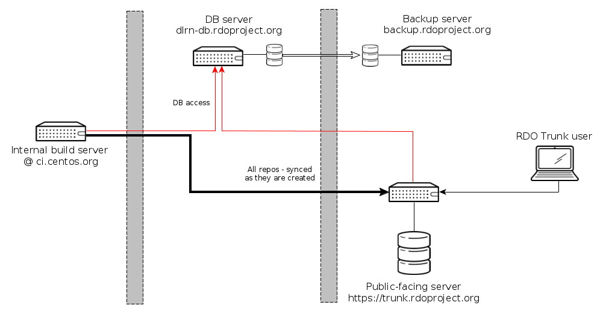

One year ago, we discussed the improvements made to the RDO Trunk infrastructure in [this post](https://www.rdoproject.org/blog/2016/07/improving-the-rdo-trunk-infrastructure/). As expected, our needs have changed in this year, and so has to change our infrastructure. So here we are, ready to describe what's new in RDO Trunk.

### New needs

We have some new needs to cover:

- A new DLRN API has been introduced, meant to be used by our CI jobs. The main goal behind this API is to break the current long, hardcoded Jenkins pipelines we use to promote repositories, and have individual jobs "vote" on each repository instead, with some additional logic to decide which repository needs to be promoted. The API is a simple REST one, defined [here](https://github.com/softwarefactory-project/DLRN/blob/master/doc/api_definition.yaml).

- This new API needs to be accessible for jobs running inside and outside the ci.centos.org infrastructure, which means we can no longer use a local SQLite3 database for each builder.

- We now have an RDO Cloud available to use, so we can consolidate our systems there.

- Additionally, hosting our CI-passed repositories in the CentOS CDN was not working as we expected, because we needed some additional flexibility that was just not possible there. For example, we could not remove a repository in case it was promoted by mistake.

### Our new setup

This is the current design for the RDO Trunk infrastructure:

- We still have the build server inside the ci.centos.org infrastructure, and not available from the outside. This has proven to be a good solution, since we are separating content generation from content delivery.

- [https://trunk.rdoproject.org](https://trunk.rdoproject.org) is now the URL to be used for all RDO Trunk users. It has worked very well so far, providing enough bandwidth for our needs.

- The database has been taken out to an external MariaDB server, running on the RDO Cloud (dlrn-db.rdoproject.org). This database is set up as master-slave, with the slave running on an offsite cloud instance that also servers as a backup machine for other services. This required [a patch to DLRN](https://github.com/softwarefactory-project/DLRN/commit/8ccdd2f9769096b5570e2aacae6389b35f5887a5) to add MariaDB support.

### Future steps

Experience tells us that this setup will not stay like this forever, so we already have some plans for future improvements:

- The build server will migrate to the RDO Cloud soon. Since we are no longer mirroring our CI-passed repositories on the CentOS CDN, it makes more sense to manage it inside the RDO infrastructure.

- Our next step will be to make RDO Trunk scale horizontally, as described [here](https://softwarefactory-project.io/storyboard/#!/story/175). We want to use our nodepool VMs in review.rdoproject.org to build packages after each upstream commit is merged, then use the builder instance as an aggregator. That way, the hardware needs for this instance become much lower, since it just has to fetch the generated RPMs and create new repositories. Support for this feature is already in DLRN, so we just need to figure out how to do the rest.
